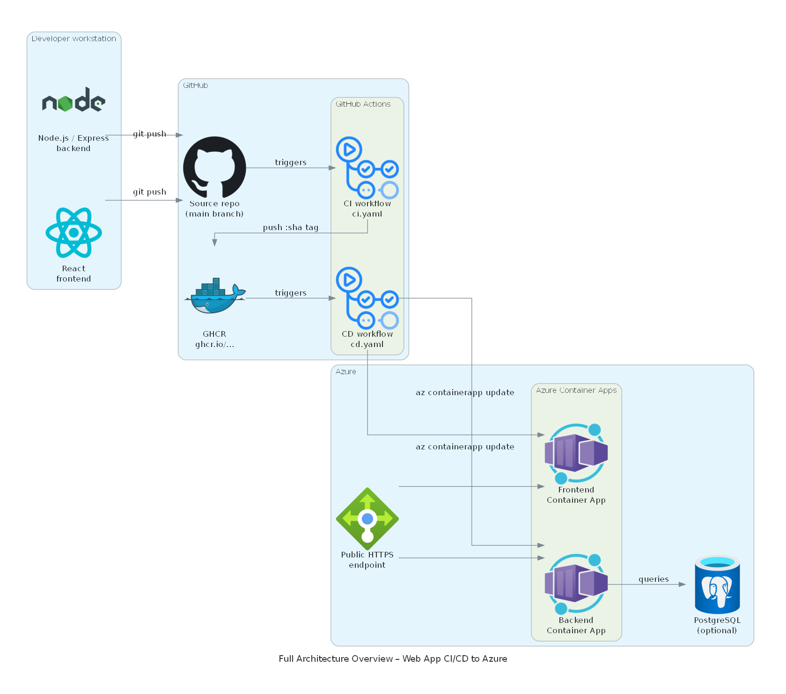

# Simple Web App with CI/CD to Azure

A full-stack web application (Node.js backend + React frontend) deployed to **Azure Container Apps** with **GitHub Actions CI/CD**.


---

##  Tech Stack

- **Backend:** Node.js, Express  
- **Frontend:** React  
- **Database:** Optional (PostgreSQL or any managed DB)  
- **Containerization:** Docker  
- **CI/CD:** GitHub Actions  
- **Cloud:** Azure Container Apps

---

##  Features

- REST API backend  
- React SPA frontend  
- Fully dockerized  
- Automated CI pipeline:
  - Linting  
  - Unit tests  
  - Docker image build  
  - Push to GitHub Container Registry  
- Automated CD pipeline:
  - Pull Docker images  
  - Deploy to Azure Container Apps  
- Immutable Docker images using Git commit SHA

---

##  Project Structure

```tree
project-root/
│
├─ backend/ # Node.js backend
│ ├─ package.json
│ └─ src/
│
├─ frontend/ # React frontend
│ ├─ package.json
│ └─ src/
│
├─ .github/workflows/ # CI/CD pipelines
│ ├─ ci.yaml
│ └─ cd.yaml
│
├─ Dockerfile # Backend Dockerfile
├─ frontend.Dockerfile # Frontend Dockerfile
└─ README.md
```

---

##  Getting Started (Local Dev)

### Backend

```bash
cd backend
npm install
npm run start

Runs on http://localhost:3000.

Frontend
cd frontend
npm install
npm run start

Runs on http://localhost:3001 (or configured port).

Run with Docker (optional)
docker build -t backend ./backend
docker run -p 3000:3000 backend

docker build -t frontend ./frontend
docker run -p 80:80 frontend
```
# CI/CD Pipeline
CI pipeline: .github/workflows/ci.yaml
Runs on every push
Installs dependencies, lint, test, build Docker images, push to GHCR
CD pipeline: .github/workflows/cd.yaml
# Deployment
Azure Container Apps provide public HTTPS URLs
Backend and frontend images are pulled from GitHub Container Registry (ghcr.io)
